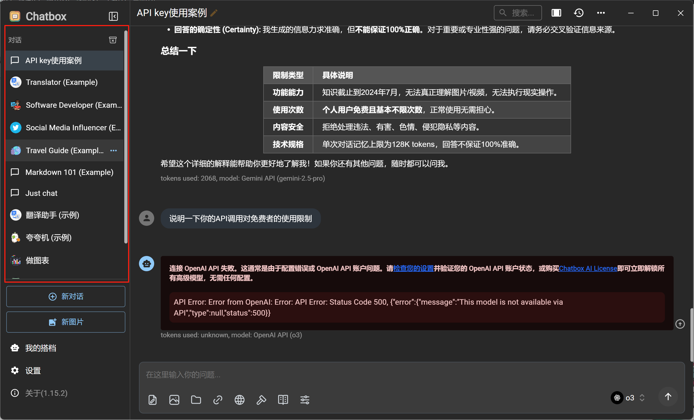
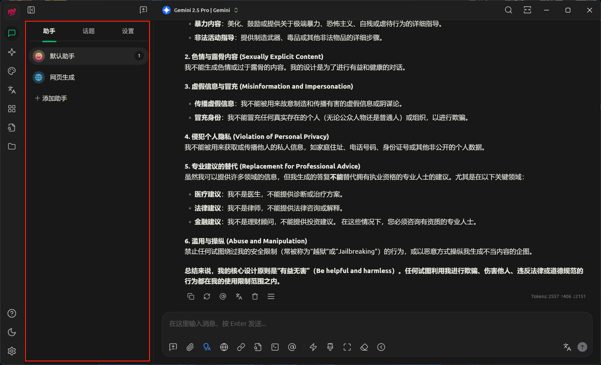

# AI客户端应用的介绍

主要可以参考CSDN上的一篇文章：[Chatbox vs Cherry Studio —— 两款热门 AI 桌面客户端到底怎么选？_chatbox cherry-CSDN博客](https://blog.csdn.net/pumpkin84514/article/details/147907192)

## 引言

### 为什么我会使用AI桌面客户端？

其实我一开始的时候仅仅是用各个客户端的网页版的，因为下载客户端还要获取 `API` 实在是很麻烦。更何况我对`API`和 `token`这些概念都不是很熟，所以也并没有那么多的需求。

但是，随着我使用的AI逐渐增多，我开始意识到不同的问题可以询问不同的AI大模型，而不是一直询问一个AI大模型，这样会使得整个聊天界面变得十分冗长和繁琐，这时候需要将部分问题丢给其他 AI 来解决问题。（题外话，为什么没有折叠部分对话的功能呢？）于是我的浏览器上就会有多个标签页：Gemini，deepseek，浙大先生，Zchat......但是我的浏览器上肯定还会有其他页面吧，于是我的页面就会非常非常多（甚至开了好几个进程）实在是太麻烦了。

所以我就选择了桌面客户端，不仅舍去了超多浏览器标签页，貌似API调用的使用限额也没降下多少。

## AI桌面客户端的选择

### 产品主要区别

|                  | Chatbox AI                                                   | Cherry Studio                                                |
| ---------------- | ------------------------------------------------------------ | ------------------------------------------------------------ |
| **核心卖点**     | “零配置、多端同步、本地数据优先”                             | “插件化、多模型并行、文档&数据处理工具箱”                    |
| **平台**         | Win / macOS / Linux / iOS / Android / Web (Chatbox AI)       | Win / macOS / Linux (移动端筹备中) (GitHub)                  |
| **模型接入**     | OpenAI, Gemini, Anthropic, Claude, Ollama, 本地 GGUF 等      | 同上 + 300+ 预设 AI Assistants, 可多模型同会话 (GitHub)      |
| **特色功能**     | - 文件/图片聊天 - 浏览器联网搜索 - 全本地聊天记录 (Chatbox AI) | - 文档批量解析 (Office/PDF) - Mermaid / 图表渲染 - 主题 / 插件 / MCP Server (GitHub) |
| **开源协议**     | GPL-3.0 (社区版) (GitHub)                                    | AUR 标记 MIT, 官方商业条款允许, 未改动代码免费商用; 改动后需遵守自定义许可 (aur.archlinux.org, docs.cherry-ai.com) |
| **GitHub 人气**  | 34.7 k ⭐ / 3.3 k forks (GitHub)                              | 26.1 k ⭐ / 2.2 k forks (GitHub)                              |
| **闭源部署难度** | 派生须开源 (GPL)                                             | MIT / Custom, 可闭源                                         |
| **典型用户**     | 独立开发者、移动端刚需、重视隐私                             | 需要文档处理、主题/插件生态、二次开发团队                    |

### 页面管理

Chatbox 和 Cherry Studio两者，在页面管理上也存在不同。

**chatbox**

页面管理上，chatbox和普通的网页端对话一样，并没有页面分类的管理。

**cherry studio**

cherry studio 的话，存在如图所示的页面管理。

### 选型建议

> 先回答一句话：个人轻度/移动优先→Chatbox；团队协同/二次开发→Cherry Studio。

| 场景                    | 推荐    | 原因                                  |
| ----------------------- | ------- | ------------------------------------- |
| 学生 & 普通办公         | Chatbox | 免费、移动端即下即用、本地隐私        |
| 产品经理写 PRD / 做幻灯 | Cherry  | Office/PDF 批量解析 + Mermaid 画图    |
| 企业安全合规 (闭源)     | Cherry  | MIT / Custom 许可更宽松; 数据可自管   |
| 嵌入公司门户 / 二开插件 | Cherry  | 官方 API + JS 插件 + MCP Server       |
| 开源极客 / 自己写脚本   | Chatbox | GPL 无限制合并其他 GPL 组件; 代码量小 |